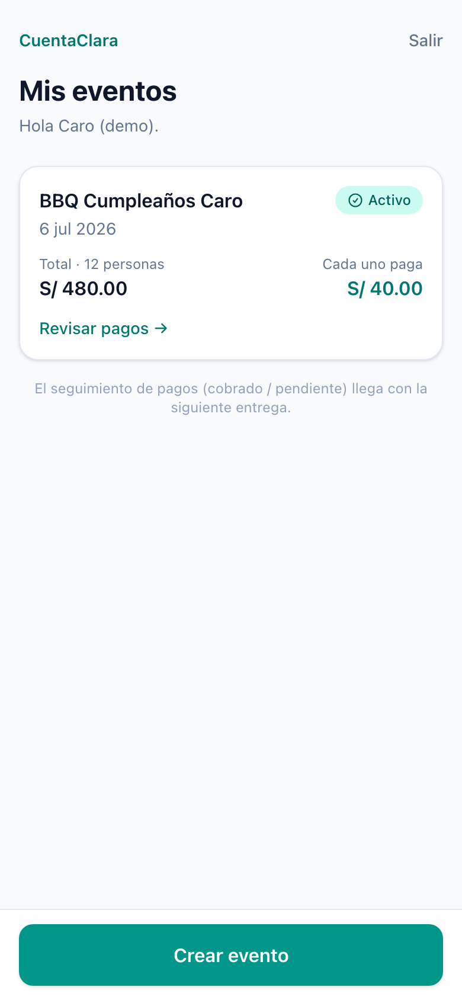
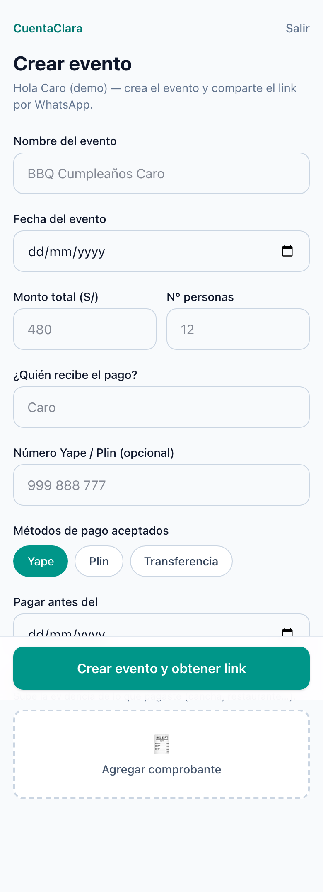
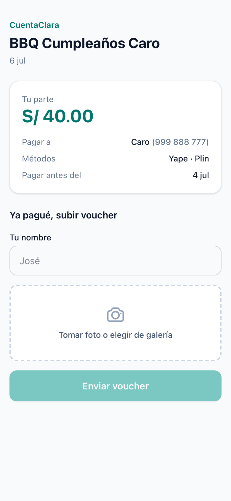
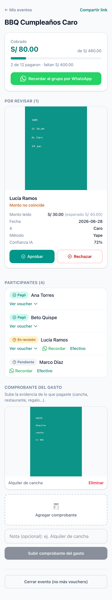
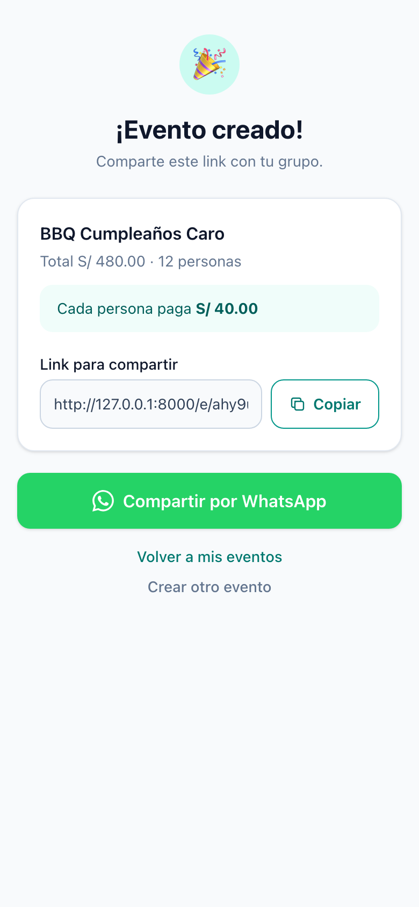

# CuentaClara

[](https://github.com/carlos3434/cuentaClara/actions/workflows/ci.yml)

> Comparte un link, cobra el dinero, y deja que la IA revise los vouchers.

**CuentaClara** es una aplicación web *mobile-first* para organizar pagos
compartidos entre amigos, compañeros de trabajo o grupos. El organizador crea un
evento, comparte un link por WhatsApp, cada participante sube su comprobante de
pago, la IA lo valida, y el organizador ve quién pagó y quién falta — revisando
solo las excepciones.

Pensado para el contexto peruano: **Yape, Plin y transferencias**, montos en
**soles (S/)**, interfaz en español.

---

## El problema

Cuando un grupo organiza un evento, alguien paga primero y luego tiene que cobrarle
a todos. Los vouchers se pierden en WhatsApp, el organizador revisa Yape/Plin a
mano, y es difícil saber cuánto se juntó y quién debe. CuentaClara se encarga del
seguimiento y la validación; **no reemplaza WhatsApp** (ahí se comparte el link).

## Características (MVP completo ✅)

| Capacidad | Detalle |
|-----------|---------|
| **Auth del organizador** | Registro / login / logout (contraseña, sesión); login con rate limit |
| **Crear evento** | Formulario mobile-first, división equitativa, link público con slug no adivinable; comprobante del gasto opcional al crear |
| **Dashboard** | `/events` — eventos del organizador, más recientes primero, con estado e iconos |
| **Participante (sin login)** | Abre el link → se identifica (solo nombre) + sube voucher, en una sola pantalla; refleja eventos cerrados |
| **Validación del comprobante** | **Navegador**: OCR ligero (`tesseract.js`, bajo demanda) que avisa si la imagen no parece un voucher de Yape/Plin/transferencia (suave, no bloquea). **Servidor**: el método detectado debe estar entre los aceptados |
| **Validación con IA** | `ValidateReceiptJob` asíncrono; drivers `FakeReceiptVision` (dev) y `AnthropicReceiptVision` (Claude vision); el veredicto lo decide un `ReceiptRuleEngine` determinista (monto + método + confianza). Si la IA falla → *en revisión*, nunca rechazo automático |
| **Cola de revisión** | `/events/{slug}/review` — cola por revisar y **cualquier** voucher inspeccionable (imagen + lectura de IA), aprobar / rechazar / marcar efectivo, totales cobrado/pendiente |
| **Recordatorios** | Links `wa.me` (al grupo y por participante pendiente) |
| **Comprobante del gasto** | Evidencia del costo real del organizador (solo almacenamiento), al crear el evento o desde la revisión |
| **Cerrar / reabrir evento** | Bloquea nuevas subidas cuando está cerrado |

Diferido a v2: división personalizada, pagos parciales/sobrepagos, detección de
duplicados, teléfonos de participantes, IA sobre el comprobante del gasto,
tiempo real, multimoneda. Ver [`docs/13`](docs/13-mvp-critique-and-simplification.md)
y la sección [Mejoras a futuro](#mejoras-a-futuro).

## Stack

- **Backend:** Laravel 13 (PHP 8.3) · Eloquent · Queues / Jobs · Form Requests · Policies · Actions · Enums (PHP 8.1)
- **Frontend:** Inertia + Vue 3 · Tailwind CSS v4 (mobile-first) · iconos SVG inline
- **Base de datos:** SQLite (dev) · MySQL/RDS (prod)
- **Almacenamiento:** disco privado local (dev) · S3 (prod) — los vouchers nunca son públicos
- **IA:** Claude vision (`claude-opus-4-8`) para extracción de comprobantes
- **Pruebas:** PHPUnit + PCOV (backend) · Vitest + Vue Test Utils + `@vitest/coverage-v8` (frontend)
- **CI:** GitHub Actions (build + ambas suites + cobertura, en cada push/PR)

## Requisitos

PHP 8.3+, Composer, Node 20+ (CI usa 22), npm.

## Instalación

```bash
composer install
npm install
cp .env.example .env
php artisan key:generate
touch database/database.sqlite
php artisan migrate
npm run build
```

## Ejecutar

```bash
# App
php artisan serve

# Assets con hot reload (en otra terminal, durante desarrollo)
npm run dev

# Worker de cola (la validación con IA corre asíncrona)
php artisan queue:work
```

Abre `http://127.0.0.1:8000` → te redirige al **dashboard** del organizador
(si no has iniciado sesión, a `/login`; registra un organizador para empezar).

> Para ver la validación con IA en una subida local sin worker, corre con
> `QUEUE_CONNECTION=sync` y `AI_DRIVER=fake` — el driver falso auto-valida.

## Configuración (.env)

```ini
# Almacenamiento de vouchers (privado). Usa s3 en producción.
RECEIPTS_DISK=local
RECEIPTS_MAX_KB=8192

# Validación con IA
AI_DRIVER=fake                 # 'fake' (dev/test) o 'anthropic' (Claude real)
AI_CONFIDENCE_THRESHOLD=0.85
ANTHROPIC_API_KEY=             # requerido cuando AI_DRIVER=anthropic
AI_MODEL=claude-opus-4-8

# Rate limits (peticiones/minuto)
RATE_LIMIT_UPLOADS=20          # POST público /e/{slug}/receipts (por IP)
RATE_LIMIT_LOGIN=10            # POST /login (por email+IP)

# Cola
QUEUE_CONNECTION=database      # 'sync' para correr la validación inline
```

## Calidad: pruebas y cobertura

| Capa | Comando | Tests | Cobertura | Piso CI |
|------|---------|-------|-----------|---------|
| **Backend** (PHPUnit) | `php artisan test` | 106 | **99.8 %** líneas (PCOV) | `--min=90` |
| **Frontend** (Vitest) | `npm run test:js` | 40 | **97.9 %** líneas (v8) | `lines ≥ 90` |

```bash
php artisan test                 # backend (SQLite en memoria, sin setup)
npm run test:js                  # frontend (jsdom)
npm run test:js:coverage         # frontend + reporte de cobertura
```

Cubren el flujo completo de punta a punta: auth, creación de evento, identificación
+ subida, el motor de reglas de IA, la cola de revisión, recordatorios, comprobantes
de gasto, endurecimiento (rate limiting, cierre) y **tests de integración** que
ejercitan el pipeline real (cola + job + reglas) sin mocks
(`tests/Feature/Flows/`). En el frontend, cada componente Vue tiene pruebas de
render e interacción con Inertia mockeado.

## Integración continua

[GitHub Actions](.github/workflows/ci.yml) corre en cada push y PR:
`npm run test:js:coverage` → `npm run build` → `php artisan test --coverage --min=90`.
El badge arriba refleja el estado de `main`.

## Cómo funciona (flujo)

```
Organizador          Sistema / IA                 Participante
    │ crea evento ──────▶                              │
    │ ◀── link público ──                              │
    │ comparte por WhatsApp ─────────────────────────▶ │ abre el link
    │                     ◀──── sube voucher ───────── │ (nombre + foto)
    │                     encola ValidateReceiptJob     │
    │                     extrae + decide veredicto     │
    │ ◀── dashboard / cola de revisión ──               │ "¡Listo!"
    │ aprueba / rechaza / efectivo                      │
    │ recuerda por WhatsApp ──────────────────────────▶ │
    │ cierra el evento                                  │
```

La IA **solo extrae** (monto, fecha, método, destinatario, confianza); el veredicto
lo decide un motor de reglas determinista y unitariamente testeado. El organizador
siempre puede sobrescribir la decisión de la IA.

## Arquitectura y decisiones

- **IA con costura intercambiable.** `ReceiptVision` es un contrato con dos
  implementaciones: `FakeReceiptVision` (por defecto, dev/test, determinista) y
  `AnthropicReceiptVision` (Claude vision real). Se elige por `AI_DRIVER`.
- **El veredicto es determinista.** El modelo solo *extrae*; `ReceiptRuleEngine`
  (puro y testeado) decide `validated` / `needs_review` por monto + método +
  confianza. Falla de IA → revisión, nunca rechazo automático.
- **Autorización con Policies.** `EventPolicy::manage` centraliza “el organizador
  solo gestiona sus eventos” (`$this->authorize('manage', $event)`).
- **Storage privado tras un gateway.** `ReceiptStorage` es el único punto de
  acceso al disco de vouchers/gastos (nunca público; URLs por streaming autorizado).
- **Enums de dominio.** Estados/método/razón son enums respaldados
  (`App\Enums\*`) con casts en los modelos — sin strings mágicos.
- **Acciones reutilizables.** p. ej. `StoreExpenseReceipt` comparte la lógica de
  guardar el comprobante entre el alta de evento y la revisión.

## Capturas

<p>
  
  
  
</p>
<p>
  
  
</p>

De izquierda a derecha: **dashboard**, **crear evento**, **landing del participante**,
**cola de revisión** (cobrado/pendiente, voucher por revisar con lectura de IA,
participantes, comprobante del gasto) y **link para compartir**.

Se regeneran con datos de demo:

```bash
php artisan migrate:fresh && php artisan db:seed --class=DemoSeeder   # login: demo@cuentaclara.test / password
QUEUE_CONNECTION=sync AI_DRIVER=fake php artisan serve &
SLUG=<demo-slug> node scripts/screenshots.mjs                          # → docs/screenshots/
```

(Mockups de cada pantalla en [`docs/04-ux-principles.md`](docs/04-ux-principles.md).)

## Mejoras a futuro

Producto (ver detalle en [`docs/13`](docs/13-mvp-critique-and-simplification.md)):

- División **personalizada** por participante (hoy solo equitativa).
- **Pagos parciales y sobrepagos** (acumular abonos hacia la parte).
- **Detección de duplicados** (mismo voucher subido dos veces).
- **IA sobre el comprobante del gasto** + alerta si el total no cuadra.
- **Recordatorios automáticos** (WhatsApp Business API) en vez de solo `wa.me`.
- **Tiempo real** (WebSockets/Echo) en vez de recargar para ver el veredicto.
- **Multimoneda**, **multi-organizador**, reembolsos.

Plataforma / calidad:

- **Despliegue** en un host con PHP (Render / Railway / Fly.io / Laravel Forge) —
  Laravel no corre como sitio estático.
- **Capturas automáticas** y **E2E** con Playwright (incl. el flujo OCR real, que
  necesita un canvas de verdad).
- **Branch protection** en `main` exigiendo el check verde de CI.
- Subir cobertura de **funciones/branches** del frontend; auditoría de
  **accesibilidad** e **i18n**.

## Documentación

El análisis de producto e ingeniería vive en [`docs/`](docs/):

- [`docs/14`](docs/14-running-the-app.md) — **qué está implementado + cómo correrlo** (empieza aquí)
- [`docs/13`](docs/13-mvp-critique-and-simplification.md) — alcance del MVP lean y diferidos a v2
- [`docs/07`](docs/07-prd.md) — PRD · [`docs/08`](docs/08-business-rules.md) — reglas de negocio
- [`docs/09`](docs/09-database-model.md) — modelo de datos · [`docs/10`](docs/10-api-proposal.md) — API
- [`docs/06`](docs/06-ai-validation.md) — pipeline de validación con IA

---

Construido sobre [Laravel](https://laravel.com) (MIT).
